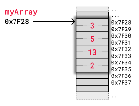

# Array
## ความหมาย
Array คือโครงสร้างข้อมูล (Data Structure) ที่ใช้จัดเก็บข้อมูลหลายค่าไว้ในตัวแปรเดียว โดยค่าที่จัดเก็บสามารถเป็นข้อมูลชนิดเดียวกัน เช่น ตัวเลข, ตัวอักษร, หรือชนิดข้อมูลอื่น ๆ โดยข้อมูลใน Array จะถูกจัดเก็บในลำดับและสามารถเข้าถึงได้โดยใช้ดัชนี (Index) ซึ่งเริ่มต้นจาก 0
## ประโยชน์ของ
1. ประหยัดพื้นที่ในการจัดเก็บข้อมูล
    - การใช้ Array ช่วยให้สามารถจัดเก็บข้อมูลหลายค่าในตัวแปรเดียว ทำให้โครงสร้างของโค้ดง่ายและเป็นระเบียบมากขึ้น

2. การเข้าถึงข้อมูลรวดเร็ว
    - การใช้ดัชนี (Index) ช่วยให้สามารถเข้าถึงข้อมูลแต่ละตำแหน่งได้อย่างรวดเร็วโดยไม่ต้องวนลูปค้นหา

3. เหมาะสำหรับการจัดการข้อมูลที่มีขนาดตายตัว
    - Array มีความเหมาะสมสำหรับข้อมูลที่จำนวนของข้อมูลคงที่ เช่น รายการคะแนนสอบ, รายการสินค้า

4. การประมวลผลข้อมูลได้ง่าย
    - สามารถใช้ลูปในการเข้าถึงหรือแก้ไขข้อมูลใน Array อย่างมีประสิทธิภาพ เช่น การหาค่าเฉลี่ย หรือการค้นหาค่าสูงสุด
## การจัดเก็บ
