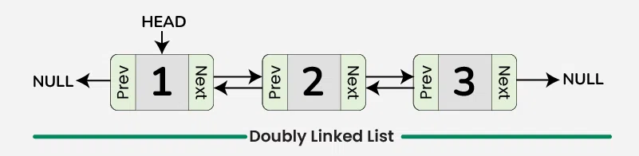
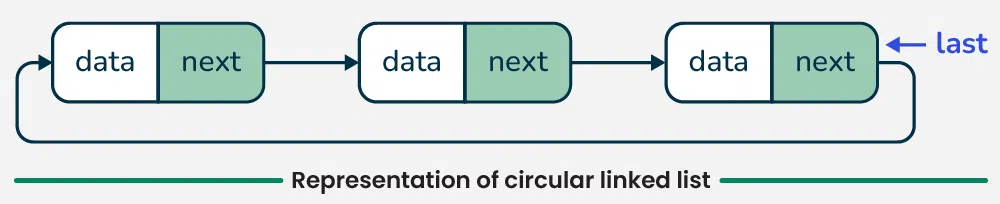
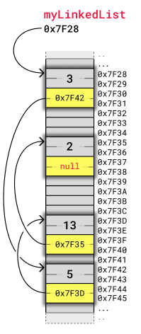

# Linked List
## ความหมาย
Linked List (ลิงก์ลิสต์) คือโครงสร้างข้อมูลแบบเชิงเส้น (Linear Data `Struct`ure) ที่ประกอบด้วยชุดของ โหนด (Nodes) ซึ่งแต่ละโหนดจะเก็บข้อมูลและตัวชี้ (Pointer) ที่อ้างอิงไปยังโหนดถัดไปในลิสต์
## โครงสร้างของ Linked List
โหนดแต่ละตัวในลิงก์ลิสต์ประกอบด้วยสองส่วนหลัก:
- ข้อมูล (Data): เก็บข้อมูลที่ต้องการจัดเก็บ
- ตัวชี้ (Pointer): ชี้ไปยังโหนดถัดไป
## ประเภทของ Linked List
1. Singly Linked List
    - แต่ละโหนดมีตัวชี้เพียงตัวเดียว ชี้ไปยังโหนดถัดไป
    - โหนดสุดท้ายชี้ไปที่ NULL

2. Doubly Linked List
    - แต่ละโหนดมีตัวชี้สองตัว ชี้ไปยังโหนดก่อนหน้าและโหนดถัดไป
    - ใช้งานได้สะดวกเมื่อจำเป็นต้องเดินทางย้อนกลับ

3. Circular Linked List
    - โหนดสุดท้ายชี้กลับไปยังโหนดแรก ทำให้เป็นวงกลม

## ข้อดีของ Linked List
1. ความยืดหยุ่น:
    - สามารถเพิ่มหรือลบข้อมูลได้โดยไม่ต้องจัดการกับการเลื่อนตำแหน่ง (Reallocation) ของข้อมูลเหมือนอาร์เรย์
    - ไม่จำเป็นต้องกำหนดขนาดคงที่ล่วงหน้า
2. ประหยัดหน่วยความจำ:
    - หากต้องการใช้พื้นที่ตามจริง จะจัดเก็บหน่วยความจำให้ตรงกับข้อมูลที่เพิ่มเข้ามาเท่านั้น
3. เหมาะสำหรับโครงสร้างข้อมูลแบบไดนามิก:
    - เช่น การสร้าง Queue, Stack, หรือ Graph
## ข้อเสียของ Linked List
1. การเข้าถึงข้อมูลช้า:
    - ไม่สามารถเข้าถึงข้อมูลด้วยดัชนี (Index) ได้ ต้องเริ่มต้นจากโหนดแรกเสมอ
2. ใช้หน่วยความจำมากขึ้น:
    - เนื่องจากแต่ละโหนดต้องเก็บตัวชี้ (Pointer) เพิ่ม
3. การใช้งานซับซ้อนกว่าอาร์เรย์:
    - การเขียนโค้ดเพื่อเพิ่ม, ลบ หรือค้นหาข้อมูลในลิงก์ลิสต์ต้องการความระมัดระวัง

## การจัดเก็บ Memory

## การสร้าง Linked List
เมื่อเรารู้จักกับ Linked List สิ่งต่อไปที่ต้องรู้จักคือ `struct` และการจอง Memory
### เหตุผลที่ต้องจอง memory
1. Linked List ไม่มีขนาดคงที่
    - ต่างจาก array ที่มีขนาดคงที่ตั้งแต่เริ่มต้น (static size)
    - การเพิ่มหรือสร้าง node ใหม่ใน Linked List จะต้องมีพื้นที่หน่วยความจำสำหรับเก็บข้อมูลและตัวชี้ (pointer)
    - ดังนั้น เราจำเป็นต้องใช้ฟังก์ชันสำหรับจองหน่วยความจำ เช่น `malloc()` หรือ calloc() ในภาษา C
2. การใช้งานหน่วยความจำแบบไดนามิก
    - Dynamic Memory Allocation ช่วยให้โปรแกรมจัดสรรพื้นที่สำหรับ node เฉพาะเมื่อจำเป็นเท่านั้น
    - หากไม่จองหน่วยความจำ การเพิ่ม node ใหม่จะไม่มีที่สำหรับเก็บข้อมูลและ pointer ทำให้โปรแกรมล้มเหลว
3. Pointer ของ Linked List ต้องชี้ไปยังหน่วยความจำใหม่
    - เมื่อสร้าง node ใหม่ แต่ละ node จะมี pointer ชี้ไปยัง node ถัดไป
    - การจองหน่วยความจำช่วยให้ pointer สามารถอ้างอิงถึงที่อยู่ของ node ได้อย่างถูกต้อง
### struct
`struct` ในภาษา C เป็นคำสั่งที่ใช้สำหรับการสร้าง โครงสร้างข้อมูล (Data `Struct`ure) ที่สามารถเก็บข้อมูลหลายประเภทเข้าด้วยกันในรูปแบบที่จัดการง่ายและสามารถใช้งานร่วมกันได้ โดยแต่ละข้อมูลภายในโครงสร้างเรียกว่า สมาชิก (members) ของ `struct`
### คำสั่งสำหรับจอง Memory => `malloc()`
`malloc()` ในภาษา C (ย่อมาจาก memory allocation) เป็นฟังก์ชันในไลบรารี <stdlib.h> ที่ใช้สำหรับการจองหน่วยความจำแบบไดนามิก (Dynamic Memory Allocation) ในช่วงเวลาที่โปรแกรมทำงาน (runtime) โดยจะคืนค่าเป็น pointer ที่ชี้ไปยังพื้นที่หน่วยความจำที่ถูกจัดสรรไว้
### คำสั่งสำหรับคืน Memory => free()
`free() `ในภาษา C เป็นฟังก์ชันที่ใช้สำหรับ คืนหน่วยความจำ (Deallocate Memory) ที่เคยจองไว้ด้วยฟังก์ชันอย่าง `malloc()`, `calloc()`, หรือ `realloc()`
### เหตุผลที่ต้องคือหน่วยความจำ หรือใช้ free()
1. ป้องกันปัญหา Memory Leak
    - Memory Leak คือสถานการณ์ที่โปรแกรมจองหน่วยความจำ แต่ไม่ได้คืนหน่วยความจำเมื่อเลิกใช้งาน
    - หน่วยความจำที่ไม่ถูกคืนจะยังคงถูกครอบครองโดยโปรแกรม และไม่สามารถใช้งานโดยโปรแกรมอื่นได้
    - หากโปรแกรมทำงานต่อไปเรื่อย ๆ และเกิด Memory Leak ซ้ำ ๆ จะทำให้หน่วยความจำของระบบหมดลง ส่งผลให้ระบบช้าลงหรือหยุดทำงานได้
2. คืนหน่วยความจำให้ระบบ
    - เมื่อจองหน่วยความจำด้วย `malloc()` หรือฟังก์ชันที่คล้ายกัน หน่วยความจำนี้จะถูกกันไว้โดยโปรแกรมของคุณจนกว่าจะสิ้นสุดโปรแกรม หรือจนกว่าคุณจะเรียก free()
    - หากคืนหน่วยความจำ ระบบปฏิบัติการสามารถนำหน่วยความจำนั้นไปจัดสรรให้โปรแกรมอื่น ๆ ที่ต้องการใช้ได้
3. ประหยัดทรัพยากรของระบบ
    - ระบบมีทรัพยากรหน่วยความจำจำกัด โดยเฉพาะในระบบที่มีทรัพยากรน้อย (embedded system)
    - การคืนหน่วยความจำเมื่อเลิกใช้งานช่วยให้โปรแกรมทำงานได้อย่างมี
4. ป้องกันข้อผิดพลาดในโปรแกรม (Bugs)
    - การไม่คืนหน่วยความจำอาจทำให้โปรแกรมทำงานผิดพลาดเมื่อใช้หน่วยความจำเพิ่มขึ้นเรื่อย ๆ
    - ตัวอย่าง: หากโครงสร้างข้อมูลอย่าง Linked List หรือ Tree ถูกสร้างซ้ำหลายครั้งโดยไม่คืนหน่วยความจำของโหนดเก่า หน่วยความจำที่ถูกจองจะเพิ่มขึ้นจนหมด
5. โปรแกรมต้องรับผิดชอบการจัดการหน่วยความจำเองในภาษา C
    - ภาษา C ไม่ได้มี `Garbage Collector` เหมือนภาษาอื่น (เช่น Python, Java) ที่จะคืนหน่วยความจำอัตโนมัติ
    - คุณต้องจัดการการคืนหน่วยความจำเองเพื่อให้แน่ใจว่าโปรแกรมทำงานอย่างมีประสิทธิภาพและไม่เกิด Memory Leak